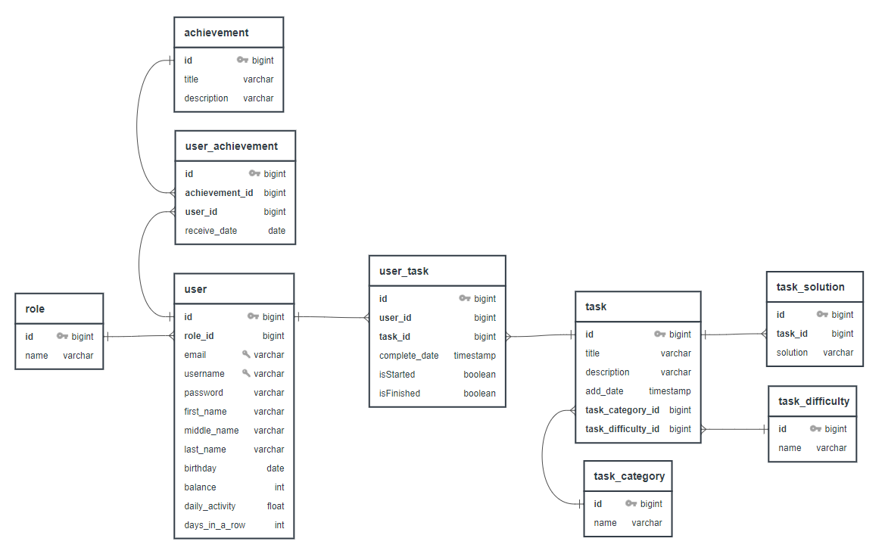

# Educational platform

## Описание

**Educational Platform** - инновационный проект, разработанный для обогащения учебного опыта старшеклассников, способствующий глубокому пониманию информатики и стимулирующий их учебные достижения.

Этот вдохновляющий проект представляет собой образовательную платформу, ориентированную на школьников старших классов. Она стремится не только предоставить учебный материал, но и вдохновить учащихся на погружение в мир информационных технологий через интересные и практические задачи. С **Educational Platform** ученики получают возможность не только углубить свои знания в области информатики, но и применить их на практике.

Платформа обеспечивает доступ к широкому спектру задач разной сложности, позволяя учащимся выбирать интересующие их направления и совершенствовать свои навыки. От задач повышенной сложности до практических заданий, **Educational Platform** способствует развитию аналитического мышления, программирования и решения реальных задач.

## Структура данных

### Таблица "role"

| Поле | Тип     | Ограничения | Описание           |
|------|---------|-------------|--------------------|
| id   | bigint  | PK          | Идентификатор роли |
| name | varchar |             | Название роли      |

### Таблица "achievement"

| Поле        | Тип     | Ограничения | Описание                 |
|-------------|---------|-------------|--------------------------|
| id          | bigint  | PK          | Идентификатор достижения |
| title       | varchar |             | Название достижения      |
| description | varchar |             | Описание достижения      |

### Таблица "user_achievement"

| Поле           | Тип    | Ограничения | Описание                   |
|----------------|--------|-------------|----------------------------|
| id             | bigint | PK          | Идентификатор связи        |
| achievement_id | bigint | FK          | Идентификатор достижения   |
| user_id        | bigint | FK          | Идентификатор пользователя |
| receive_date   | date   |             | Дата получения достижения  |

### Таблица "user"

| Поле           | Тип     | Ограничения | Описание                           |
|----------------|---------|-------------|------------------------------------|
| id             | bigint  | PK          | Идентификатор пользователя         |
| role_id        | bigint  | FK          | Идентификатор роли                 |
| email          | varchar | UNIQUE      | Электронная почта пользователя     |
| username       | varchar | UNIQUE      | Имя пользователя                   |
| password       | varchar |             | Пароль пользователя                |
| first_name     | varchar |             | Имя пользователя                   |
| middle_name    | varchar |             | Отчество пользователя              |
| last_name      | varchar |             | Фамилия пользователя               |
| birthday       | date    |             | Дата рождения пользователя         |
| balance        | int     |             | Баланс пользователя                |
| daily_activity | float   |             | Ежедневная активность пользователя |
| days_in_a_row  | int     |             | Дни подряд активности              |

### Таблица "user_task"

| Поле          | Тип       | Ограничения | Описание                   |
|---------------|-----------|-------------|----------------------------|
| id            | bigint    | PK          | Идентификатор связи        |
| user_id       | bigint    | FK          | Идентификатор пользователя |
| task_id       | bigint    | FK          | Идентификатор задачи       |
| complete_date | timestamp |             | Дата завершения задачи     |
| is_started    | boolean   |             | Флаг начала задачи         |
| is_finished   | boolean   |             | Флаг завершения задачи     |

### Таблица "task"

| Поле               | Тип       | Ограничения | Описание                              |
|--------------------|-----------|-------------|---------------------------------------|
| id                 | bigint    | PK          | Идентификатор задачи                  |
| title              | varchar   |             | Название задачи                       |
| description        | varchar   |             | Описание задачи                       |
| add_date           | timestamp |             | Дата добавления задачи                |
| task_category_id   | bigint    | FK          | Идентификатор категории задачи        |
| task_difficulty_id | bigint    | FK          | Идентификатор уровня сложности задачи |

### Таблица "task_category"

| Поле | Тип     | Ограничения | Описание                |
|------|---------|-------------|-------------------------|
| id   | bigint  | PK          | Идентификатор категории |
| name | varchar |             | Название категории      |

### Таблица "task_difficulty"

| Поле | Тип     | Ограничения | Описание                       |
|------|---------|-------------|--------------------------------|
| id   | bigint  | PK          | Идентификатор уровня сложности |
| name | varchar |             | Название уровня сложности      |

## Стек технологий

- **Java**: Основной язык программирования.
- **Spring Boot**: Фреймворк для создания приложений.
- **Spring Data JPA**: Упрощает работу с базой данных.
- **Spring Security**: Обеспечивает безопасность.
- **Liquibase**: Управление миграциями базы данных.
- **JWT**: Аутентификация и передача данных.
- **PostgreSQL**: Реляционная база данных.
- **JUnit**: Фреймворк для тестирования.
- **Lombok**: Упрощает создание Java-классов.
- **Jackson**: Работа с форматом JSON.
- **Spring REST Docs**: Документация для REST API.
- **Spring Boot Test**: Инструменты для тестирования приложений.

## Как развернуть

[TODO] Добавить поддержку docker-compose 

## API

### Получение информации о пользователе

- **Endpoint**: `GET /api/v1/user/lk`
- **Описание**: Получение информации об авторизованном пользователе при переходе в личный кабинет.

### Список задач

- **Endpoint**: `GET /api/v1/task/list`
- **Описание**: Получение списка всех доступных задач.

- **Endpoint**: `GET /api/v1/task/{id}`
- **Описание**: Получение информации о задаче по её уникальному идентификатору.

### Аутентификация и регистрация

- **Endpoint**: `POST /api/v1/auth/login`
- **Описание**: Аутентификация пользователей.

- **Endpoint**: `POST /api/v1/auth/register`
- **Описание**: Регистрация новых пользователей.

### Административные операции

- **Endpoint**: `GET /api/v1/admin`
- **Описание**: Получение списка существующих пользователей.

- **Endpoint**: `GET /api/v1/admin/{id}`
- **Описание**: Получение данных пользователя по идентификатору через административный интерфейс.

- **Endpoint**: `POST /api/v1/admin/add`
- **Описание**: Добавление пользователя через административный интерфейс.

- **Endpoint**: `DELETE /api/v1/admin/delete/{id}`
- **Описание**: Удаление пользователей по идентификатору через административный интерфейс.

- **Endpoint**: `PUT /api/v1/admin/edit/{id}`
- **Описание**: Редактирование данных пользователя по идентификатору через административный интерфейс.
